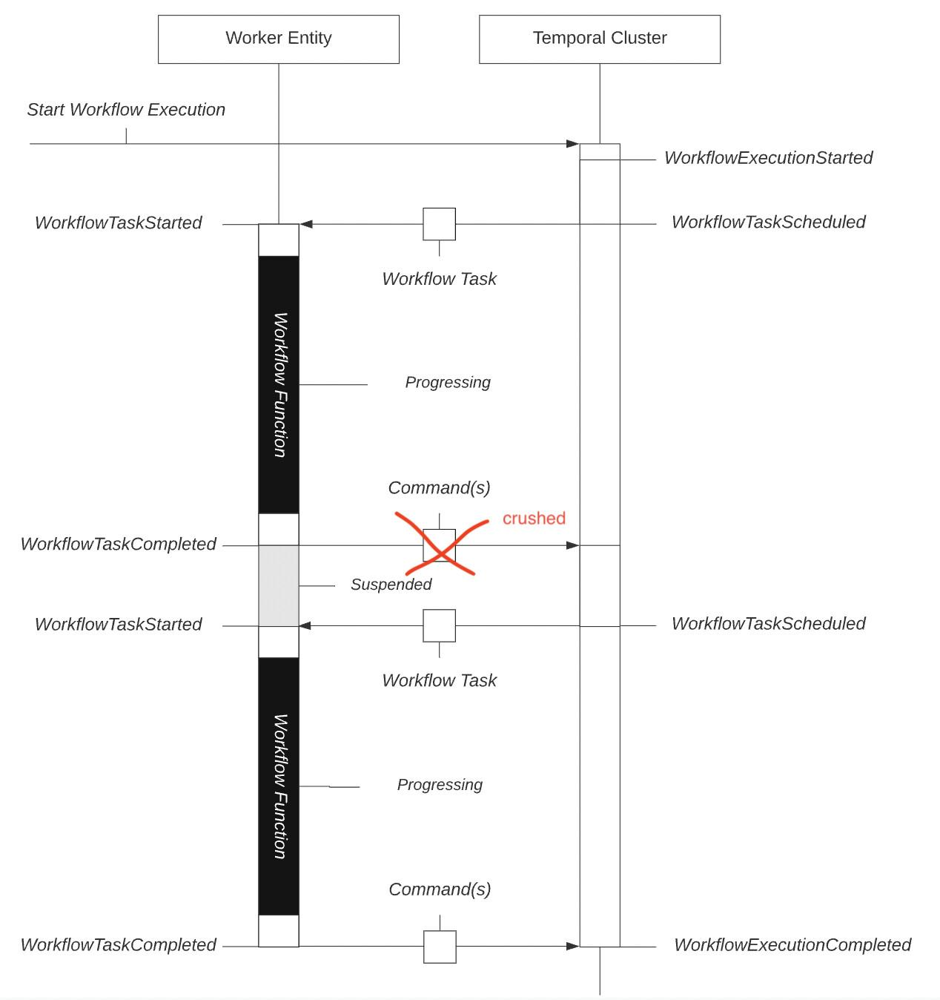

# Understanding Temporal Cloud - Step by Step

## What is Temporal Cloud?

Temporal Cloud is a managed workflow orchestration platform.

It **does not execute your business logic**. Instead, it manages the lifecycle of your workflows, including:

- Workflow state
- Event history
- Task queues
- Scheduling
- Retries
- Timeouts

Your application (Workers) executes the actual business logic.

---

# Architecture Overview

```text
                    User
                     │
                     ▼
              Backend API
                     │
      Start Workflow (SDK)
                     │
                     ▼
             Temporal Cloud
        (Workflow Orchestration)
                     │
          Creates Activity Task
                     │
                     ▼
               Task Queue
                     │
                     ▼
            Worker (GKE Pod)
                     │
        Executes Business Logic
                     │
       Database / APIs / Services
```

---

# Components

## 1. Backend API

The backend receives requests from users.

Example:

```
POST /create-order
```

The backend **does not execute the workflow directly**.

Instead, it starts a workflow using the Temporal SDK.

Example:

```java
workflow.start(orderId);
```

The SDK communicates with Temporal Cloud using secure gRPC.

---

## 2. Temporal Cloud

Temporal Cloud acts as the **Control Plane**.

It stores workflow information but never executes your business code.

It manages:

- Workflow State
- Event History
- Task Queues
- Scheduling
- Retries
- Timeouts

---

## 3. Worker

Workers run inside your infrastructure.

Examples:

- Kubernetes (GKE)
- Virtual Machines
- AWS ECS
- Azure
- Serverless

Workers contain your business logic.

Example:

```java
chargeCustomer();
reserveInventory();
sendEmail();
```

---

# Example Workflow

Suppose an online shopping application.

The workflow is:

```text
Create Order
      │
      ▼
Validate Order
      │
      ▼
Charge Payment
      │
      ▼
Reserve Inventory
      │
      ▼
Send Email
      │
      ▼
Complete
```

---

# Step 1 - Start Workflow

Customer places an order.

```
POST /orders
```

Backend receives request.

Backend calls

```java
workflow.start(order123);
```

Temporal Cloud creates a new Workflow Execution.

---

# Step 2 - Workflow State

Temporal Cloud stores the workflow state.

Example

```text
Workflow ID : order-123

Current Step : Validate Order

Status : Running
```

After validation:

```text
Workflow ID : order-123

Current Step : Charge Payment

Status : Running
```

After payment:

```text
Workflow ID : order-123

Current Step : Reserve Inventory

Status : Running
```

Temporal always knows where the workflow currently is.

---

# Step 3 - Event History

Temporal stores every event that occurs.

Example

```text
1. WorkflowExecutionStarted

2. ActivityScheduled
   ValidateOrder

3. ActivityCompleted
   ValidateOrder

4. ActivityScheduled
   ChargePayment

5. ActivityFailed
   ChargePayment

6. TimerStarted
   Retry after 5 minutes

7. TimerFired

8. ActivityScheduled
   ChargePayment Retry

9. ActivityCompleted
   ChargePayment

10. ActivityScheduled
    ReserveInventory

11. ActivityCompleted
    ReserveInventory

12. WorkflowCompleted
```

This is called **Event History**.

Nothing is lost.

Even if the Worker crashes,
Temporal still has the complete history.

---

# Step 4 - Task Queue

Temporal never executes activities.

Instead it creates tasks.

Example

```text
Workflow wants:

Charge Payment
```

Temporal creates

```text
Task

Activity:
ChargePayment

Queue:
payments
```

The task waits inside the queue.

```text
Temporal Cloud

Task Queue

-------------------------

Charge Payment

Reserve Inventory

Send Email
```

---

# Step 5 - Worker Polling

Workers continuously ask Temporal

```text
Do you have work for me?
```

Temporal replies

```text
Execute:

Charge Payment

Order ID:

123
```

Worker receives the task.

---

# Step 6 - Activity Execution

Worker executes your code.

```java
paymentGateway.charge();
```

The code runs inside your Worker.

NOT inside Temporal Cloud.

Worker sends result back.

```text
Success
```

or

```text
Failure
```

Temporal records the result.

---

# Step 7 - Scheduling

Suppose payment fails.

Business requirement

```
Retry after 5 minutes.
```

Without Temporal

```java
Thread.sleep(300000);
```

Bad idea.

Worker stays busy.

Memory wasted.

---

Temporal stores

```text
Wake up

12:30 PM
```

Nothing runs.

Worker is free.

At 12:30 PM

Temporal automatically creates another task.

Worker receives

```
Retry Payment
```

---

# Step 8 - Worker Crash

Suppose Worker crashes.

Current step

```
Charge Payment
```

Worker dies.

Without Temporal

- Workflow lost
- Retry logic lost
- State lost

---

With Temporal


Temporal already stored

```text
Workflow Running

Current Step

Charge Payment
```

A new Worker starts.

Temporal gives the same task to another Worker.

Workflow continues.

---

# Example Timeline

```text
10:00

Workflow Started

↓

10:01

Validate Order

↓

10:02

Payment Started

↓

10:03

Worker Crashed

↓

10:04

New Worker Started

↓

10:04

Retry Payment

↓

10:05

Inventory Reserved

↓

10:06

Email Sent

↓

Workflow Completed
```

---

# Workflow State Example

Current state

```text
Workflow ID

order-123

Status

Running

Current Activity

Reserve Inventory

Retry Count

1

Next Retry

None
```

Temporal manages this automatically.

---

# Event History Example

```text
Workflow Started

↓

Order Validated

↓

Payment Failed

↓

Retry Scheduled

↓

Payment Success

↓

Inventory Reserved

↓

Email Sent

↓

Workflow Completed
```

Every event is permanently stored.

---

# Scheduling Example

Workflow

```
Generate Monthly Invoice
```

Requirement

```
Run every month.
```

Temporal stores

```text
Schedule

First Day

00:00 UTC
```

No cron job needed.

Temporal triggers the workflow automatically.

---

# Task Queue Example

Suppose there are three Workers.

```text
Worker 1

Worker 2

Worker 3
```

Temporal Task Queue

```text
Task 1

Task 2

Task 3

Task 4

Task 5
```

Workers pick tasks independently.

```text
Worker 1 → Task 1

Worker 2 → Task 2

Worker 3 → Task 3

Worker 1 → Task 4

Worker 2 → Task 5
```

Scaling becomes easy.

---

# Encryption

Temporal Cloud encrypts data:

## In Transit

Communication between:

- Backend
- Workers
- Temporal Cloud

uses TLS.

```text
Worker
    │
 TLS
    │
Temporal Cloud
```

Nobody can read the network traffic.

---

## At Rest

Workflow data stored inside Temporal Cloud databases is encrypted.

This includes

- Workflow State
- Event History
- Metadata
- Task Information

If someone accesses the storage directly,
the data remains encrypted.

---

# What Runs Where?

## Your Infrastructure (GKE)

```text
Backend API

Workers

Business Logic

Database Connections

External API Calls
```

---

## Temporal Cloud

```text
Workflow State

Event History

Task Queue

Scheduling

Retries

Timers

Timeouts

Workflow Coordination
```

---

# Example with Your GKE Architecture

```text
                   Client
                      │
                      ▼
                 Backend API
               (Running on GKE)
                      │
         Start Workflow using SDK
                      │
                      ▼
               Temporal Cloud
        ----------------------------
        Workflow State
        Event History
        Task Queue
        Scheduling
        ----------------------------
                      │
          Activity Task Created
                      │
                      ▼
             Worker (GKE Pod)
                      │
          Connect to Tenant DB
                      │
                      ▼
            Tenant MySQL Database
```

---

# Responsibilities

| Component | Responsibility |
|-----------|----------------|
| Backend API | Starts workflows |
| Worker | Executes business logic |
| Temporal Cloud | Manages workflow execution |
| Database | Stores application data |
| SDK | Connects application to Temporal |

---

# Key Takeaways

- Temporal Cloud never executes your business logic.
- Workers execute Activities.
- Temporal stores Workflow State.
- Temporal records every Event.
- Temporal manages Task Queues.
- Temporal handles Retries and Scheduling.
- Workflows survive Worker crashes.
- Data is encrypted in transit and at rest.
- Workers can scale independently of Temporal Cloud.